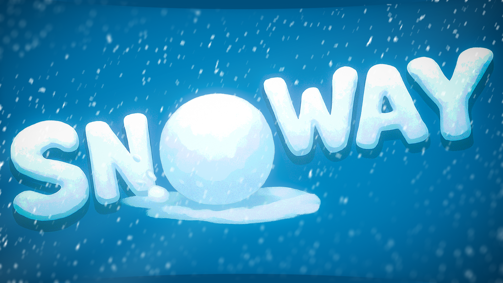
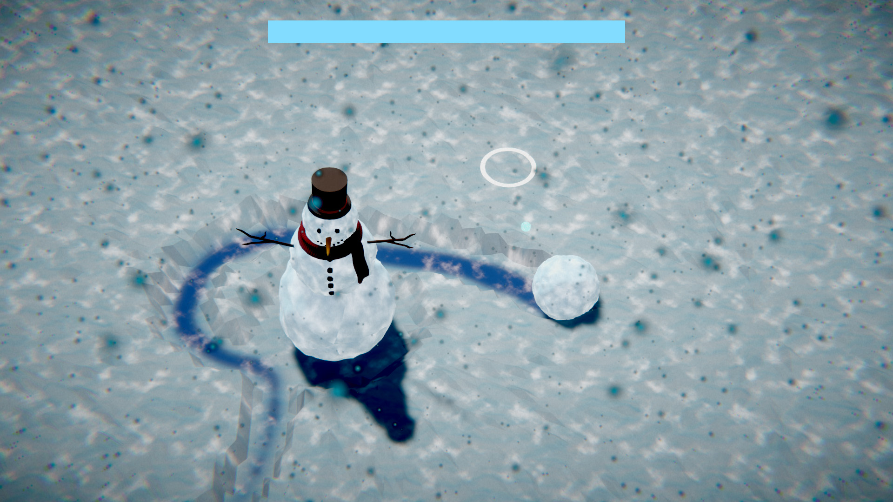
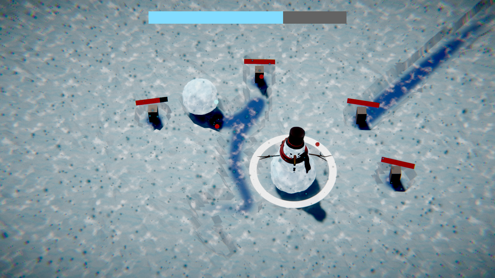

# SNoWay 🎮

**A snowy defense game made for [Ludum Dare 58](https://ldjam.com/events/ludum-dare/58) — Theme: "Collector"**

Roll as a snowball to grow bigger by collecting snow and protect your snowman from melting candles. Throw snowballs to destroy enemies or heal your snowman. How long can you survive?

---

## 🕹️ Gameplay

- Roll around the field to collect snow and grow in size.
- Protect the snowman from waves of candles trying to melt him.
- Throw snowballs to attack enemies or heal your snowman.
- Survive as long as possible — the game ends when the snowman melts.

### Showcase

  
  

  
  

---

## 🎮 Controls

| Action           | Key / Mouse              |
|-----------------|-------------------------|
| Move snowball    | Move your mouse (follows snowball) |
| Stop following   | Right Mouse Button       |
| Throw snowball   | Left Mouse Button        |
| Rotate camera    | Q / E                   |

---

## 💻 Requirements

- Windows 10 or later

**Note:** Web build is not supported due to tessellation shader limitations.

---

## 📥 Downloads

- **Itch.io**: [https://skal3.itch.io/snoway](https://skal3.itch.io/snoway)  
- **Ludum Dare**: [https://ldjam.com/events/ludum-dare/58/snoway](https://ldjam.com/events/ludum-dare/58/snoway)  
- **Gameplay Video**: [YouTube](https://www.youtube.com/watch?v=M-LARtJGn4Q)

---

## 🎨 Roles:

- **Game, code, design, art, and SFX**: Viktor Pariienko  

---

## 📜 License

This project is licensed under the **MIT** – see the [LICENSE](LICENSE) file for details.

---

## 💡 Notes / Postmortem

- Developed in **3 days (~40 hours)** for Ludum Dare 58
- Built entirely in **Unity**
- Learned a lot about:
  - Full-cycle game development under tight deadlines
  - Physics-based gameplay and balancing
  - Debugging last-minute issues under pressure
